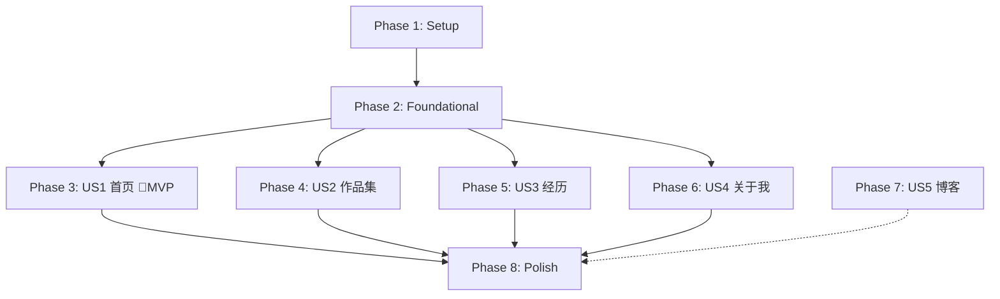

# Tasks: 个人网站 (Personal Portfolio Website)

**Input**: Design documents from `specs/001-personal-website/`

**Prerequisites**: plan.md ✅, spec.md ✅, research.md ✅, data-model.md ✅, contracts/ ✅

**Tests**: No automated test framework for MVP — manual visual verification per task.

**Organization**: Tasks grouped by user story for independent implementation and testing.

## Phase 1: Setup (Shared Infrastructure) ✅

**Purpose**: 项目初始化和基础工程搭建

- [x] T001 Create project with `npx create-next-app@latest portfolio --typescript --app --src-dir --import-alias "@/*"` in parent directory
- [x] T002 [P] Install dependencies: `npm install gray-matter` in portfolio/
- [x] T003 Create directory structure
- [x] T004 [P] Configure next.config.ts with output: 'export' for SSG
- [x] T005 [P] Create CSS variable theme system in src/app/globals.css (light + dark mode tokens, palette #edf6f9 / #ffddd2 / #83c5be / #006d77)

---

## Phase 2: Foundational (Blocking Prerequisites) ✅

**Purpose**: 所有页面共享的基础设施 — MUST complete before any user story

**⚠️ CRITICAL**: No user story work can begin until this phase is complete

- [x] T006 Create ThemeProvider context in src/lib/theme.ts with localStorage persistence + system preference detection
- [x] T007 [P] Create content loading utilities in src/lib/content.ts (read markdown files, parse frontmatter, sort by date)
- [x] T008 [P] Create root layout in src/app/layout.tsx (fonts, metadata, ThemeProvider wrapper)
- [x] T009 [P] Create Header component in src/components/layout/Header.tsx (nav links, active state highlighting, responsive hamburger menu)
- [x] T010 [P] Create Footer component in src/components/layout/Footer.tsx (social links, copyright)
- [x] T011 [P] Create MobileNav component in src/components/layout/MobileNav.tsx (slide-out drawer navigation)
- [x] T012 [P] Create ThemeToggle component in src/components/ui/ThemeToggle.tsx (sun/moon icon toggle)
- [x] T013 [P] Create Section wrapper component in src/components/ui/Section.tsx (consistent padding, title, subtitle)
- [x] T014 [P] Create Tag component in src/components/ui/Tag.tsx (variant: default/accent/outline, size: sm/md)
- [x] T015 [P] Create sample content files: 5 projects in src/content/projects/, experiences.json, profile.json

**Checkpoint**: ✅ Foundation ready

---

## Phase 3: User Story 1 — 首页品牌展示 (Priority: P1) 🎯 MVP ✅

**Goal**: 招聘方访问首页，5秒内感受到设计品质、清晰的转型定位、明确的浏览引导

- [x] T016 [US1] Create Hero section in src/components/home/Hero.tsx
- [x] T017 [US1] Create NarrativeTimeline in src/components/home/NarrativeTimeline.tsx
- [x] T018 [P] [US1] Create FeaturedProjects in src/components/home/FeaturedProjects.tsx
- [x] T019 [US1] Build home page in src/app/page.tsx
- [x] T020 [US1] Add page metadata in layout.tsx

**Checkpoint**: ✅ 首页可独立验证

---

## Phase 4: User Story 2 — 作品集浏览 (Priority: P1) ✅

**Goal**: 招聘方可浏览5个项目的卡片网格，点击查看项目详情

- [x] T021 [P] [US2] Create ProjectCard in src/components/project/ProjectCard.tsx
- [x] T022 [P] [US2] Create ProjectGallery in src/components/project/ProjectGallery.tsx
- [x] T023 [P] [US2] Create ProjectDetail in src/components/project/ProjectDetail.tsx
- [x] T024 [US2] Build project grid page in src/app/projects/page.tsx
- [x] T025 [US2] Build project detail page in src/app/projects/[slug]/page.tsx
- [x] T026 [US2] Add metadata for project pages

**Checkpoint**: ✅ 作品集可独立验证

---

## Phase 5: User Story 3 — 经历阐述阅读 (Priority: P2) ✅

**Goal**: 招聘方阅读经历页，理解从设计到AI的完整转型路径

- [x] T027 [US3] Create Timeline component in src/components/experience/Timeline.tsx
- [x] T028 [US3] Build experience page in src/app/experience/page.tsx
- [x] T029 [US3] Add metadata for experience page

**Checkpoint**: ✅ 经历页可独立验证

---

## Phase 6: User Story 4 — 关于我 (Priority: P2) ✅

**Goal**: 招聘方了解候选人的全面画像、技能栈、联系方式

- [x] T030 [P] [US4] Create About page in src/app/about/page.tsx (headshot, bio, skill categories with tags, social links)
- [x] T031 [P] [US4] Contact section with email + social links
- [x] T032 [US4] Add metadata for about page
- [x] T033 [US4] Dark mode support (inherited from global theme system)

**Checkpoint**: ✅ 关于我页面可独立验证

---

## Phase 7: User Story 5 — 博客 (预留) (Priority: P3)

- [x] T034 [P] [US5] Create blog index page
- [x] T035 [P] [US5] Create blog post page
- [x] T036 [US5] Document content update workflow

---

## Phase 8: Polish & Cross-Cutting Concerns ✅

- [x] T037 自定义404页面
- [x] T038 SEO增强（sitemap, robots, JSON-LD）
- [x] T039 骨架屏loading状态（6个页面）
- [x] T040 错误边界error.tsx + global-error
- [x] T041 暗色模式QA + 对比度修复
- [x] T042 性能优化（Lighthouse 97/96/100/100）
- [x] T043 可访问性增强（SkipLink, aria-current, 对比度WCAG AA）

---

## Dependencies & Execution Order

### Phase Dependencies

### User Story Dependencies

- **US1 (P1)**: 可独立于其他 story 开发 — 🎯 **MVP 范围**
- **US2 (P1)**: 可独立开发 — 与 US1 并行（项目内容复用已建好的 content 目录）
- **US3 (P2)**: 可独立开发 — 与 US1/US2 并行
- **US4 (P2)**: 可独立开发 — 与 US1/US2/US3 并行
- **US5 (P3)**: 可独立开发 — 在所有内容结构完成后进行

### Parallel Opportunities

- Phase 1-2 顺序执行（Setup → Foundational）
- Phase 3-6 (US1-US4) 全部可并行开发！
- 每个 Phase 内标记 [P] 的任务可并行

---

## Implementation Strategy

### MVP First (US1 Only - Phase 1 + 2 + 3)

1. Complete Phase 1: Setup — 5 tasks
2. Complete Phase 2: Foundational — 10 tasks
3. Complete Phase 3: US1 (首页) — 5 tasks
4. **STOP and VALIDATE**: 首页可访问，导航可用，配色统一，响应式正常
5. 部署 MVP 到 Vercel

### Incremental Delivery

1. ✅ Setup + Foundational → 基础架子搭好
2. 🎯 **US1 首页 + US2 作品集 → 可展示的 MVP** (P1 优先)
3. ➕ US3 经历 + US4 关于我 → 内容完整 (P2)
4. ➕ US5 博客 + Polish → 锦上添花 (P3)

---

## 任务统计

| 阶段 | 任务数 | 优先级 | 并行任务 |
|------|--------|--------|----------|
| Phase 1: Setup | 5 | 🔴 阻塞 | 3 |
| Phase 2: Foundational | 10 | 🔴 阻塞 | 8 |
| Phase 3: US1 首页 | 5 | 🔴 P1 | 1 |
| Phase 4: US2 作品集 | 6 | 🔴 P1 | 3 |
| Phase 5: US3 经历 | 3 | 🟡 P2 | 0 |
| Phase 6: US4 关于我 | 4 | 🟡 P2 | 2 |
| Phase 7: US5 博客 | 3 | 🟢 P3 | 2 |
| Phase 8: Polish | 9 | 🟢 P3 | 7 |
| **总计** | **45** | — | **26** |
